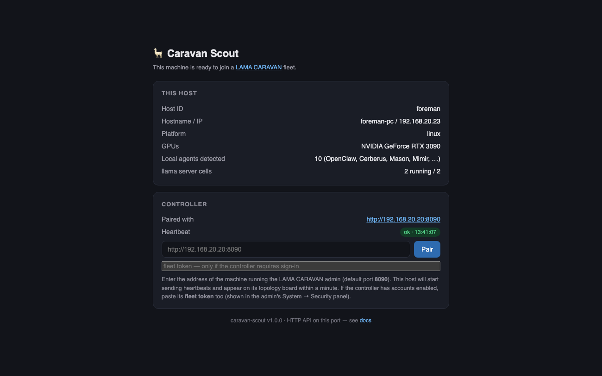

# Caravan Scout

The client-side sidecar of the [LAMA CARAVAN](https://github.com/thepr0metheus/lama-caravan)
control plane. **Formerly known as `llm-easy-route-agent`** — if you see that
name in older screenshots, configs or docs, it is this project.

One small service per machine that lends its hardware to the fleet: it
reports the machine — GPUs, CPU/RAM, running cells — and executes the
controller's commands: run llama.cpp and command server cells locally,
download models, update llama.cpp. It knows nothing about the AI agents or
clients that may live on the same box: those are the controller's records,
made by hand, and a client needs nothing installed.

Dependency-light on purpose: Python standard library only, one JSON config,
a small HTTP API on `:8092`.

## Why put a scout on a box

The controller can only run models where it can see hardware. The scout is how
a machine's hardware becomes visible and usable:

- **A machine with a GPU** (even a modest one) becomes a place where the
  fleet can run models: reserve a cell on the board, pick a model, press
  Start — the scout downloads the GGUF from the controller's cache, launches
  `llama-server`, reports load progress and cell activity back to the board.
  An old 12 GB card serving a small model at night is real capacity the
  router can use.
- **A machine without one** can still run CPU cells (speech recognition,
  small models) the same way.
- Every scout reports GPUs, VRAM, running compute apps and its heartbeat, so
  the board shows the fleet's real hardware in one place.

A machine where AI agents run (OpenClaw, Hermes, anything with an OpenAI-style
`baseUrl`) needs no scout: the operator adds it on the controller's board as a
client and gives each agent a proxy port by hand.

Why it's safe to adopt: standard library Python only, one JSON config, one
small HTTP surface on `:8092`, systemd/launchd units, and the
[pairing page](#pairing-with-a-controller-no-config-editing) means setup is
"install, open a browser, paste the controller address".

The bigger picture — hybrid local/cloud routing, queues, schedules, spend
accounting — is the controller's story: see
[LAMA CARAVAN → Why](https://github.com/thepr0metheus/lama-caravan#why-lama-caravan)
and the worked example
[a day with the caravan](https://github.com/thepr0metheus/lama-caravan/blob/main/docs/day-with-the-caravan.md).

## Requirements

| Component | Requirement |
|---|---|
| OS | Linux with systemd --user, or macOS (launchd) |
| Python | **3.10+**, standard library only — no pip packages |
| For llama cells | a `llama-server` binary on this host (`scripts/install.sh` can build it; CUDA optional) |
| For GPU info | NVIDIA driver + `nvidia-smi` (optional — CPU-only hosts are fine) |
| Network | reach the controller's `:7990`; the scout listens on `:8092` |

## Documentation

| Doc | Covers |
|---|---|
| [docs/architecture.md](docs/architecture.md) | Role in the control plane, flows, the Variant-2 command contract, module layout |
| [docs/http-api.md](docs/http-api.md) | Every endpoint of the `:8092` surface + contracts with the controller |
| [docs/operations.md](docs/operations.md) | Install, services, deploy, config/runtime files, quirks |

## Role

The controller (lama-caravan, `:7990`) is the topology registry and the single
command builder. The scout:

- reports host identity, GPU/CPU inventory and compute apps in a heartbeat
  every 60 s (every 5 s while a cell is loading);
- starts/stops llama.cpp **server cells** on this host from configs built by
  the controller (models are downloaded from the controller and cached);
- runs generic **command cells** (e.g. a whisper server) the same way — the controller
  supplies both the start line and the cell server files themselves;
- updates or rolls back llama.cpp on this host when the controller asks.

```text
Machine A (any GPU or no GPU)          Machine B (controller)
┌─────────────────────────────┐        ┌──────────────────────────────┐
│  caravan-scout :8092        │◄──────►│  LAMA CARAVAN admin :7990    │
│  ┌───────────────────────┐  │        │  Topology board:             │
│  │ llama-server (NVIDIA) │  │        │  • Machine A as a node       │
│  └───────────────────────┘  │        │  • its GPUs and cells        │
│  ┌───────────────────────┐  │        │  • "＋ Reserve cell"         │
│  │ command cell (whisper)│  │        │    → model served over HTTP  │
│  └───────────────────────┘  │        │                              │
└─────────────────────────────┘        └──────────────────────────────┘
```

## Install

One-liner on a fresh client host (Linux or macOS):

```sh
git clone <your-remote>/caravan-scout.git ~/projects/caravan-scout
cd ~/projects/caravan-scout
./scripts/install.sh --admin-url http://<controller-ip>:7990
```

| Situation | What happens |
|---|---|
| Linux + NVIDIA GPU | Installs CUDA toolkit, builds `llama.cpp` with CUDA, sets up the model cache |
| Linux, no GPU | Installs the agent only |
| macOS | Installs the agent + launchd service |

The host appears on the controller's Topology board within one heartbeat
(≤ 60 s). Flags: `--admin-url <url>`, `--skip-llama`, `--llama-tag <tag>`.

### Speech engines (standalone, run when you want one)

Not part of `install.sh` on purpose — each takes minutes and most hosts need
none of them. Run the one you want, then add a cell of that runner in the
caravan:

```sh
./scripts/install-moonshine.sh    # 🌙 CPU speech-to-text + synthesis
./scripts/install-transcribe.sh   # 📝 transcribe.cpp — GGUF ASR on ggml (CUDA/Metal)
./scripts/install-tts.sh          # 🛠 voice-clone TTS cells
```

`install-transcribe.sh` builds a C++ library from source (cmake + a few
minutes), unlike the others which only make a venv. It is what gives a client
a good RUSSIAN recognizer: GigaAM-v3 sits near 8% WER against 21-25% for
whisper large-v3, from a 260 MB GGUF the controller ships to the cell's model
cache on first start.

## Pairing with a controller (no config editing)

If you skipped `--admin-url` (or want to re-point the host later), open the
agent's built-in page from any browser:

```
http://<this-host-ip>:8092/
```



It shows what the scout found on this machine (GPUs, running cells) and has a
single **Pair** field — paste the controller address
(`http://<controller-ip>:7990`), press Pair, and the host saves it to
`config.json`, sends a heartbeat immediately and reports whether the
controller answered. No file editing, no restart.

If the controller has sign-in enabled, paste its **fleet token** into the
second field (the admin shows it in System → Security); it is stored as
`controllerToken` and from then on both directions of scout ⇄ controller
traffic authenticate with it.

Manual start:

```sh
cp examples/config.example.json config.json   # edit hostId/controllerUrl
python3 -m caravan_scout.app --config config.json --state state.json
```

## Default ports

| Port | Service |
|---|---|
| `7990` | LAMA CARAVAN admin (controller) |
| `8092` | this agent |
| `8180` | llama-server on the client (default, configurable) |

## Config reference

```json
{
  "hostId": "host-a",
  "displayName": "host-a",
  "listenHost": "0.0.0.0",
  "listenPort": 8092,
  "controllerUrl": "http://<controller-ip>:7990",
  "heartbeatIntervalSeconds": 60,
  "llamaServerBin": "~/llama.cpp/build/bin/llama-server",
  "modelsBasePath": "~/llama-model-cache",
  "llamaNodeDefaultPort": 8180,
  "cleanOldModels": false
}
```

| Field | Description |
|---|---|
| `controllerUrl` | The LAMA CARAVAN admin URL the heartbeat posts to. |
| `llamaServerBin` | Path to the `llama-server` binary (set by `install.sh`). |
| `modelsBasePath` | Local cache dir for downloaded models. |
| `controllerToken` | The fleet token, when the controller has sign-in enabled (the pairing page stores it). |

## API

See [docs/http-api.md](docs/http-api.md). In one line each: GET
`health · state · llama-node/status · monitor/nvidia-smi · host/listeners ·
llama-node/configs · llama-node/list-cache · llama-node/update-status ·
llama-node/builds`; POST `controller-url · heartbeat · llama-node/start ·
llama-node/stop · llama-node/update · llama-node/restore ·
llama-node/purge-cache · llama-node/configs/delete · host/reboot ·
host/poweroff`.

## Services

```sh
# Linux (systemd --user; installed by install.sh)
systemctl --user restart caravan-scout.service
journalctl --user -u caravan-scout.service -f

# macOS (launchd; installed by install.sh)
launchctl kickstart -k gui/$UID/com.caravan-scout
```

Cells **survive agent restarts**: the units keep child processes alive
(`KillMode=process` / `AbandonProcessGroup`) and the fresh agent re-adopts
them from its registry (`state.json`) — same pid, same uptime, inference
uninterrupted. Orphans that match the llama-server binary but are not in the
registry are reaped. Details: [docs/operations.md](docs/operations.md).

## Deployment rule

Source moves through git only: `commit → push → git pull on each client host →
restart the agent`. No `scp`. Runtime files (`state.json`, `var/`,
`llama-node-configs/`, the model cache) never go through git.

## Safety model

Open by default on a trusted LAN; once a fleet token is configured, every
endpoint except the pairing page and `/api/health` requires it. Command cells
execute controller-supplied shell — do not expose the port beyond your LAN.
